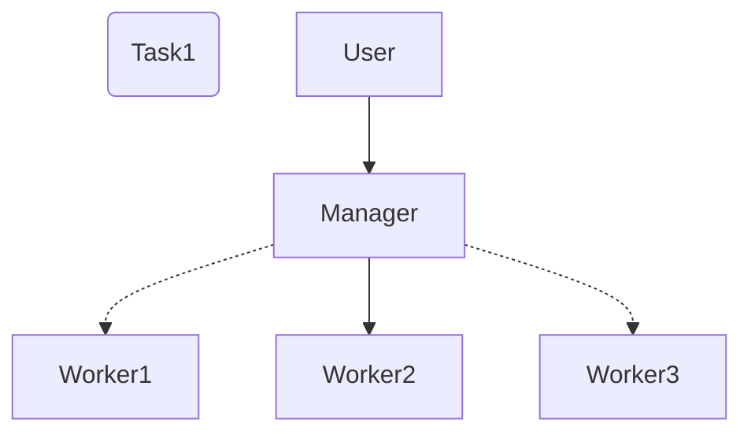

# Corg
Corg is an orchestrator written in Golang for education propose.
It based on Tim Boring book [Build an Orchestrator in Go (From Scratch)](https://www.manning.com/books/build-an-orchestrator-in-go-from-scratch)

## Simplified orhestrator model

The user submits a task to the Manage node, which then selects Worker2 to run the task.
The dotted line to Worker1 and Worker3 represents that these nodes were considered but ultimately not selected to run the task. 