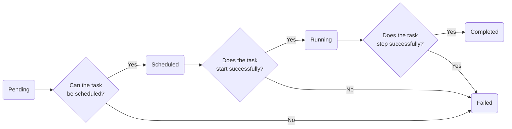

# Task State

 - Pending
 - Scheduled
 - Running
 - Completed
 - Failed

##  Transition table
| CurrentState |    Event      | NextState |
|--------------|:-------------:|----------:|
| Pending      | ScheduleEvent | Scheduled |
| Pending      | ScheduleEvent | Failed    |
| Scheduled    | StartTask     | Running   |
| Scheduled    | StartTask     | Failed    |
| Running      | StopTask      | Completed |