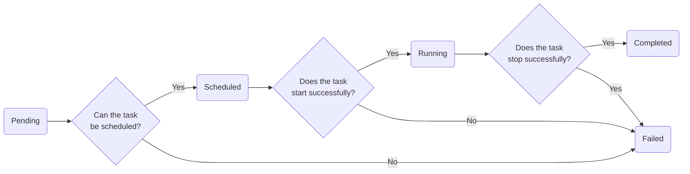

# Task State

 - Pending
 - Scheduled
 - Running
 - Completed
 - Failed

```mermaid
flowchart LR
scheduled{Can the task
be scheduled?}
started{Does the task
start successfully?}
stopped{Does the task
stop successfully?}

P(Pending) --> scheduled
scheduled -- Yes --> S(Scheduled)
scheduled -- No --> F(Failed)
S --> started
started -- Yes --> R(Running)
started -- No --> F
R --> stopped
stopped -- Yes --> c(Completed)
stopped -- Yes --> F
```
